Lo primero que hice fue descargarme **Visual Studio Code** y ver diferentes tutoriales para tener un conocimiento general. Algunos de los tutoriales fueron:

Al principio no entendí del todo la consigna, pero tenía muchas ganas de probar y equivocarme. Me salté pasos: bajé la plantilla buscando en el navegador y no desde Moodle, y se me ocurrió explorar Visual Studio Code. Me bajé Copilot dentro de Visual Studio Code (que es un asistente de IA) y le pedí lo siguiente a Gemini:

*“Necesito que me armes un prompt. La página ya está creada mediante una plantilla, entonces necesito los prompts necesarios para utilizar Copilot de manera eficiente. Programa los prompts uno a uno para que yo pueda ir dándole instrucciones a Copilot dentro de Visual Studio Code. Mi nombre es Paula Díaz Calo, Diseñadora Industrial, perfil producto, interés por las nuevas materialidades e innovación. Necesito que respetes la plantilla, pero que la edites según mi perfil personal. Los prompts tienen que prever el análisis del proyecto. (No quiero que armes los prompts, quiero que me ayudes a diseñar esta instrucción para que otra IA arme los prompts)”.*

Y me devolvió este prompt para Copilot:

Tu objetivo es crear una secuencia organizada de prompts de tipo "Paso a Paso" (Step-by-Step) para ejecuciones directas dentro de Visual Studio Code usando GitHub Copilot. Estos prompts permitirán adaptar una plantilla existente de MkDocs al perfil profesional de una diseñadora industrial.

Contexto del usuario y perfil:
Nombre: Paula Díaz Calo

Profesión: Diseñadora Industrial (Perfil Producto)

Áreas de interés/enfoque: Nuevas materialidades e innovación

Herramienta: Sitio web generado en MkDocs con entorno en Visual Studio Code.

Premisa clave: Se debe respetar la estructura básica de la plantilla actual de MkDocs, pero adaptando todo el texto, secciones, jerarquías de contenido y placeholders visuales al perfil de Paula.

Requisitos para la generación de la secuencia de prompts:
Analítica de archivos previa (Fase 1): Antes de modificar código, el primer prompt debe pedirle a Copilot que analice el proyecto local (archivos como mkdocs.yml, estructura de carpetas en docs/, hojas de estilo CSS o plantillas Jinja/HTML) para entender cómo está estructurada la plantilla.

Prompts individuales e independientes: Diseña los prompts uno a uno, para que el usuario pueda copiarlos y pegarlos individualmente en el chat o editor de Copilot dentro de VS Code.

**Flujo de trabajo estructurado:**

**Prompt 1:** Análisis y mapeo de la estructura actual de la plantilla.

**Prompt 2:** Configuración general del sitio (mkdocs.yml: título, navegación, metadatos, perfil de Paula).

**Prompt 3:** Edición/Redacción de la página de inicio (Landing/Home) destacando su enfoque en producto, nuevas materialidades e innovación.

**Prompt 4:** Estructuración de las páginas de proyectos/portafolio (incluyendo secciones para especificaciones técnicas de materiales y procesos de diseño).

**Prompt 5:** Reemplazo y gestión de imágenes/placeholders (sugerencias para integrar fotografías de productos y prototipos).

**Prompt 6:** Personalización de estilos (CSS personalizado / paletas de color en MkDocs para reflejar identidad industrial).

Formato claro: Cada prompt sugerido debe ser muy específico, usar contexto explícito (refiriendo a archivos concretos como mkdocs.yml o carpetas en docs/) y estar formateado en bloques de código para facilitar su copia.

Llegué a este resultado:

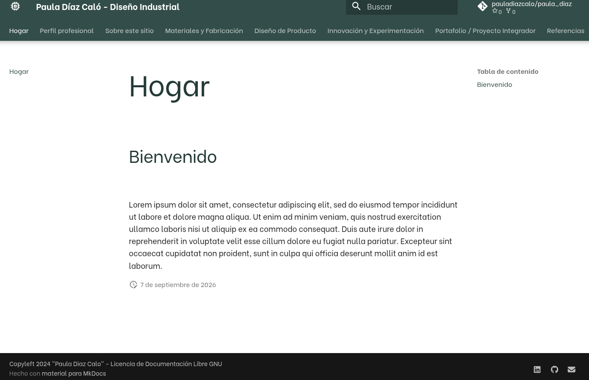{: width="800px"}

Que tan mal no está, pero si te pones a ver en detalle, la IA me había modificado todo: desde el color hasta el formato. (Hay preguntas que le hice en el trayecto a la IA sobre dudas para poder terminar de armarla).

**¡A partir de aquí comenzó la web real que ven hoy en día!**

Primero me descargué la plantilla desde Moodle. Luego la abrí en Visual Studio Code e hice el paso a paso como mencionaba el archivo README. Mi primer obstáculo fue la parte de clonar el repositorio directamente en mi PC para poder trabajarlo dentro de VS Code. Copiaba el enlace que me figuraba en GitHub:

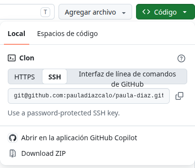{: width="500px"}

...y me daba error. Entonces pensé que otra manera de hacerlo era descargando la carpeta ZIP, pero consultando en Discord, Mathias me comentó que no, que debía copiar el enlace. Sin embargo, la terminal me seguía lanzando un error.

Carolina se comunicó conmigo para ofrecerme ayuda y lo pudimos resolver. El problema fue que, cada vez que copiaba, me agregaba un símbolo al final (el cual no ves en el enlace, pero cuando lo pegas, ¡sí aparecía!). El símbolo era este: ~. Luego me di cuenta de que lo pegaba por defecto.

A veces, un mal tipeo o un símbolo de más puede cambiar todo el código y dar error.

Luego hicimos una carpeta dentro de la que ya teníamos y colocamos la plantilla allí en otra carpeta, pero de alguna forma me habían quedado las carpetas duplicadas:

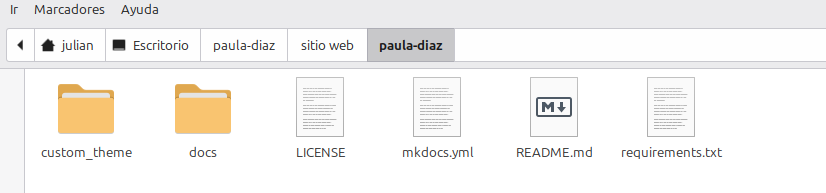{: width="700px"}

No me molestaba tanto que estuviera una carpeta dentro de otra, sino que dentro de cada carpeta de paula-diaz estaba la información repetida. Por lo tanto, cuando realizaba modificaciones en Visual Studio Code no se reflejaban, porque estaba trabajando sobre una carpeta que no correspondía. Por eso le pregunté a la IA (Gemini) si me ayudaba y seguí sus pasos:

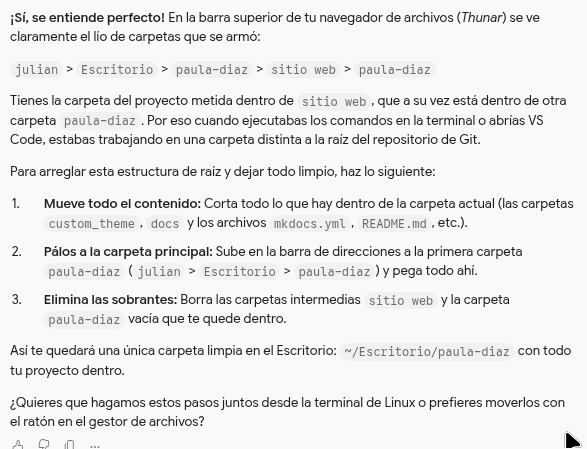{: width="700px"}
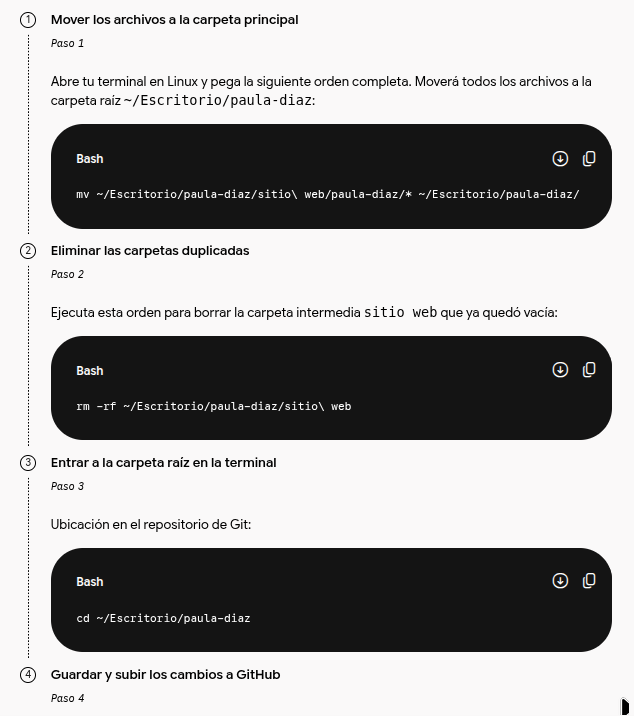{: width="700px"}

Pero la terminal de mi PC arrojó un error y se lo pegué a la conversación:

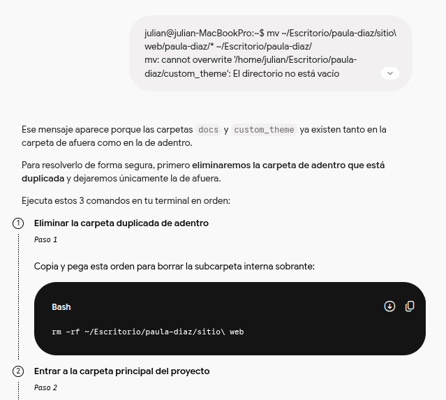{: width="700px"}

Me dio error o algo inesperado, le copié tal cual lo que me figuraba y me respondió lo siguiente:

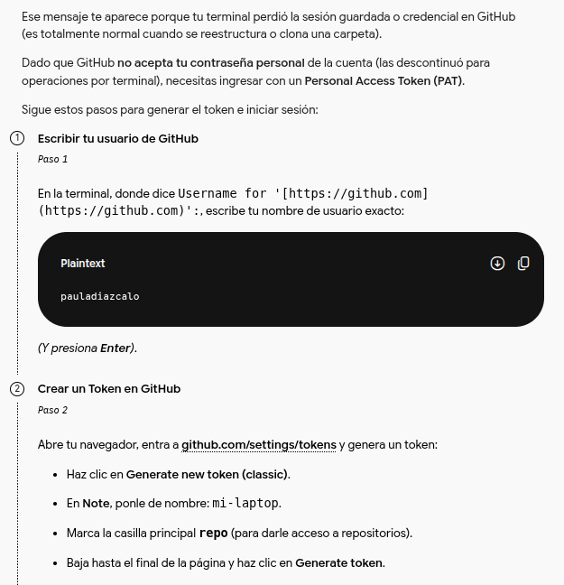{: width="700px"}

Tuve que hacer un token, pero me continuaba dando error. Decidí colocarle el error y continuar con las instrucciones de la IA:

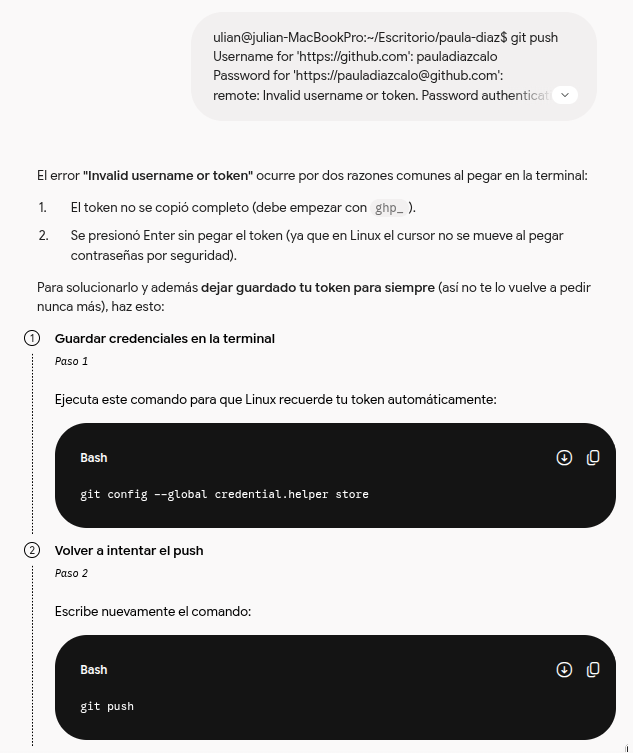{: width="700px"}

Luego de insistir y colocarle las instrucciones, quedó:

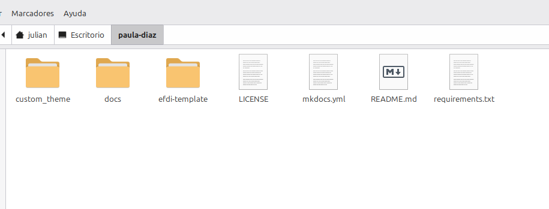{: width="700px"}

Comencé a realizar la sección de "About me" y el mayor problema fueron las imágenes: me quedaban en diferentes tamaños o muy grandes. Quería colocar dos imágenes en la misma línea, pero quedaba una arriba y otra abajo, y muy grandes:

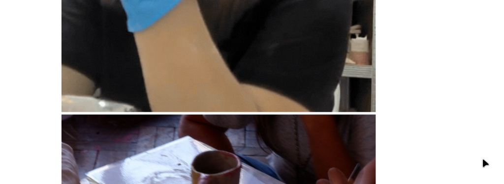{: width="700px"}

Con los códigos de esta forma:

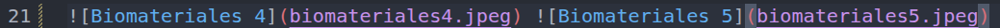{: width="700px"}

Consultando en clase, le coloqué el código sugerido por los profesores y quedó de esta forma:

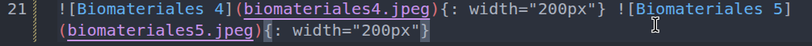{: width="700px"}

Generando el resultado que se visualiza en la página hasta el momento.

Para colocar los videos, los puse como GIF, ya que eran videos de 10 segundos y la IA me sugirió que los subiera de esa forma; pero al ponerlos, me quedaban desproporcionados con la foto de al lado:

{: width="700px"}

Por lo tanto, le volví a preguntar a la IA y solo me daba sugerencias con HTML, el cual aún desconozco, y me iba a quedar algo complejo para lo que es mi nivel actual:

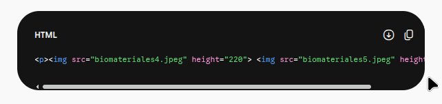{: width="700px"}

Por lo tanto, tomé la decisión de que quizás el GIF y la imagen estaban hechos en diferentes tamaños. Así que edité tanto el GIF como la imagen, borré los archivos de la PC, volví a subir los archivos editados y... ¡charán! Quedó listo. :)
