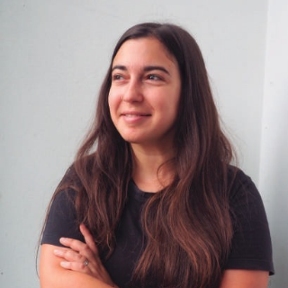
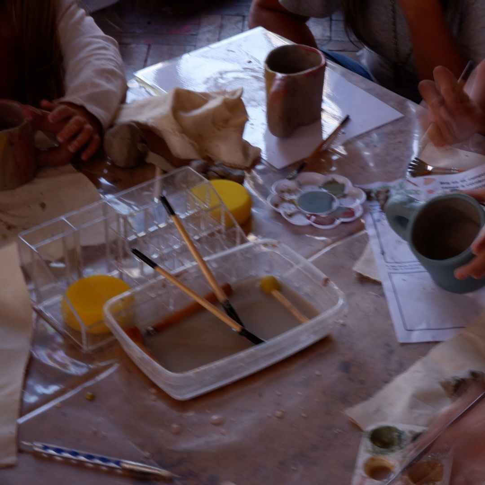
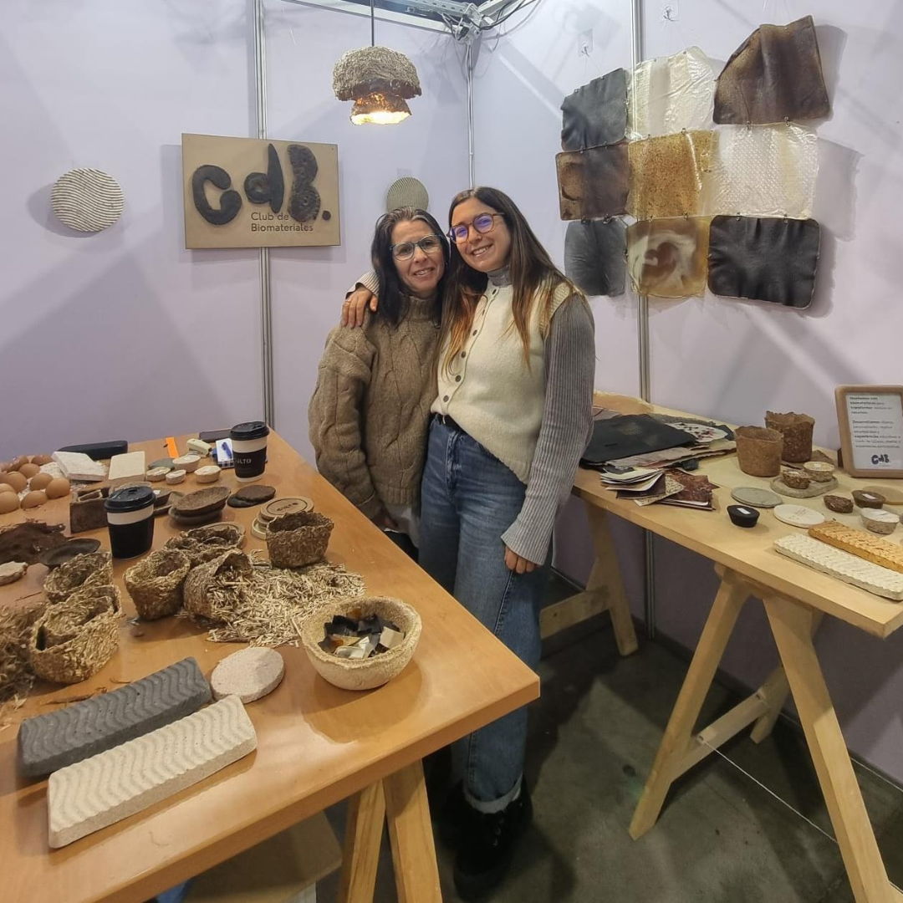
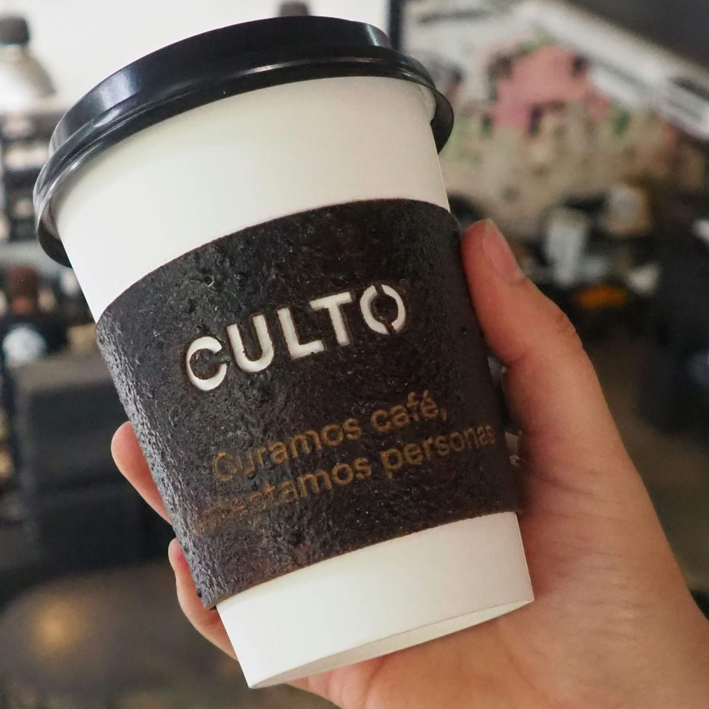
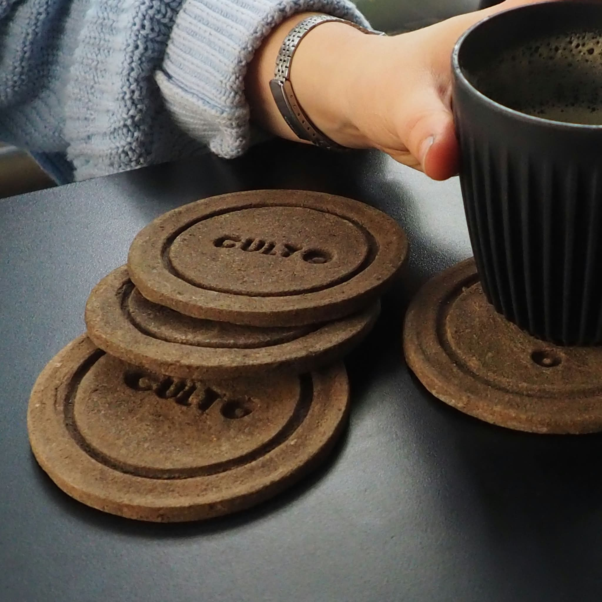

 asl

# Sobre mi

{: width="400px"}

Soy **diseñadora industrial**, con perfil orientado al desarrollo de productos. Me considero una persona *curiosa y creativa*, con especial interés en los procesos que combinan diseño, arte e innovación. Me gusta crear, experimentar con materiales y encontrar nuevas formas de transformar ideas en experiencias y objetos. Disfruto especialmente de los proyectos con un propósito social, educativo o ambiental, y de trabajar en espacios donde pueda aprender, compartir y aportar 🎨🌿

{: width="375px"}   {: width="375px"}

También tengo un gran interés por la **cerámica.** Durante un tiempo llevé adelante un emprendimiento junto con amigas. Actualmente continúo produciendo por mi cuenta en mis tiempos libres 💕

{: width="375px"} {: width="375px"}

Junto a Pao Maldonado integramos el **Club de Biomateriales,** un espacio de enseñanza, acompañamiento y desarrollo en torno a los biomateriales. Trabajamos a pedido y realizamos talleres de manera esporádica 🪸🌱

{: width="375px"} {: width="375px"}

*Club de Biomateriales* [CldB](https://www.instagram.com/biomaterials_club?stkn=dWxtdmJhM2ZydTRj)

{: width="375px"} {: width="375px"}

*Parte del trabajo de grado "Biomateriales a partir de la revalorización de residuos gastronómicos de cafeteria local" que realizamos junto con Lucia Berasain*

Además, trabajo como freelance y en espacios vinculados a lo social. Tengo gustos e intereses muy variados, por eso disfruto involucrarme en proyectos diferentes. Soy bastante inquieta en todos los sentidos 🤸🏽‍♀️
